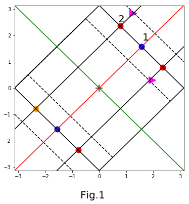
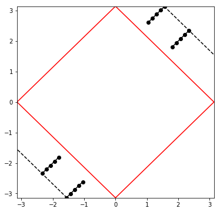
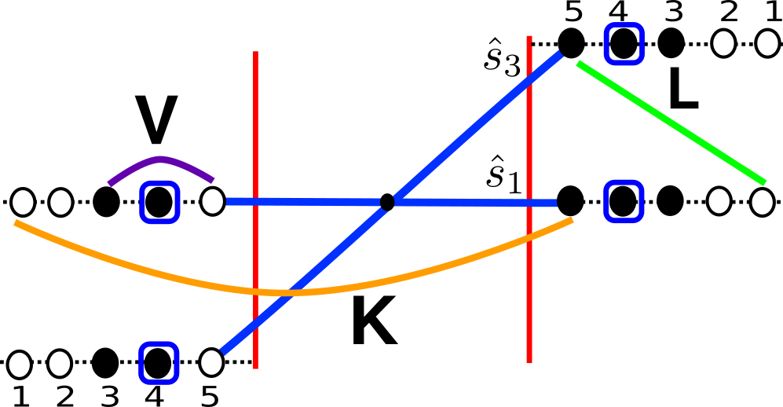

# Entanglement distillation  in a correlated quantum liquid


```python
import numpy as np
import matplotlib.pyplot as plt
```

__Generating the Fermi surface for the electronic dispersion $\epsilon_{\mathbf{k}}=-2t(\cos k_{x}+\cos k_{y})$__ at $\mu =0$ $\Rightarrow$ $k_{Fx}+k_{Fy}=\pi$


```python
kFx=np.linspace(0,np.pi,100)
kFy=np.pi-np.linspace(0,np.pi,100)
plt.rcParams['figure.figsize'] = [6,6]
plt.plot(kFx,kFy,color='k')
plt.plot(kFx,-kFy,color='k')
plt.plot(-kFx,-kFy,color='k')
plt.plot(-kFx,kFy,color='k')
plt.plot(kFx+0.5,kFy+0.5,color='k',linestyle='--')
plt.plot(kFx-0.5,kFy-0.5,color='k',linestyle='--')
plt.plot(-kFx+0.5,-kFy+0.5,color='k',linestyle='--')
plt.plot(-kFx-0.5,-kFy-0.5,color='k',linestyle='--')
plt.plot(-kFx-0.5,kFy-0.5,color='k',linestyle='--')
plt.plot(-kFx-0.5,kFy-0.5,color='k',linestyle='--')
plt.plot(np.linspace(-np.pi,np.pi,100),np.linspace(-np.pi,np.pi,100),color='r',linestyle="-")
plt.plot(np.linspace(-np.pi,np.pi,100),-np.linspace(-np.pi,np.pi,100),color='g',linestyle="-")
plt.plot(np.linspace(-np.pi,np.pi,100),np.linspace(-np.pi,np.pi,100)+np.pi/2.,color='k',linestyle="-")
plt.plot(np.linspace(-np.pi,np.pi,100),np.linspace(-np.pi,np.pi,100)-np.pi/2.,color='k',linestyle="-")
plt.text(1.6, 1.8, '1',size=20)
plt.text(0.7, 2.5, '2',size=20)
plt.xlim(-np.pi,np.pi)
plt.ylim(-np.pi,np.pi)
plt.scatter(np.pi/4,3*np.pi/4,s=120,color='red')
plt.scatter(np.pi/2,np.pi/2,s=120,color='blue')
plt.scatter(3*np.pi/4,np.pi/4,s=120,color='red')
plt.scatter(-np.pi/4,-3*np.pi/4,s=120,color='red')
plt.scatter(-np.pi/2,-np.pi/2,s=120,color='blue')
plt.scatter(-3*np.pi/4,-np.pi/4,s=120,color='orange')
plt.scatter(np.pi/2.5,np.pi/1.1,color='magenta',s=200,marker='>')
plt.scatter(np.pi/1.6,np.pi/10.5,color='magenta',s=200,marker='>')
plt.scatter(0,0,color='black',s=200,marker='+')
plt.text(-0.7,-4.2,"Fig.1",size=20)
Lambda0=np.pi/np.sqrt(2)
plt.show()
```





__Construction of isogeometric curves parallel to the Fermi surface $\mathbf{k}_{\Lambda\hat{s}}=\mathbf{k}_{F\hat{s}}+\Lambda\hat{s}$__

The dashed lines represents isogeometric curves parallel to Fermi surface. The red dot(1) and blue dot(2) in Fig.1 represents the normal $\hat{s}$. In this program we consider the normal vectors(1) and (2) and there reflection counterparts about the lines $k_{x}=k_{y}$ (red)and $k_{x}=-k_{y}$(green). The magenta triangles comprise a resonant pair involving states $\hat{s}=(s_{x},s_{y}$ and $T\hat{s}=(s_{y},s_{x})$.


```python
Lambda0=np.pi/np.sqrt(2)
RGsteps=25
LambdaF=(Lambda0/(2.15*np.sqrt(2)))*np.linspace(0.0,1.,RGsteps)[::-1]
delta =-4.0
kx=np.array([np.pi/2+LambdaF,np.pi/4+LambdaF])
ky=np.array([np.pi/2+LambdaF,3*np.pi/4+LambdaF])
kx1=np.array([np.pi/2-LambdaF+delta/np.sqrt(2),3*np.pi/4-LambdaF+delta/np.sqrt(2)])
ky1=np.array([np.pi/2-LambdaF+delta/np.sqrt(2),np.pi/4-LambdaF+delta/np.sqrt(2)])
```


```python
1/(LambdaF[0]-LambdaF[1])
```


    32.84958025416716


__Writing electronic dispersion for states residing along normals $1$ and $2$ and there reflection counter parts marked by magenta dots.__


```python
EkOut=np.array([-2*(np.cos(kx[0])+np.cos(ky[0])),-2*(np.cos(kx[1])+np.cos(ky[1]))])
EkInT=np.array([-2*(np.cos(kx1[0])+np.cos(ky1[0])),-2*(np.cos(kx1[1])+np.cos(ky1[1]))])
#Bandwith W=8t, t=1
W=8
```

__Defining the magnitude of the bare Hubbard coupling $U_{0}=8/N$ in momentum space and the flucn. scale__ $\omega=W/2$ 


```python
U0 = 8./(50)
omega = W/2.
```

__Renormalization group equations resulting out of the unitary transformations<br>
Hubbard Model
$H=\sum\epsilon_{\mathbf{k}_{\Lambda\hat{s}}}\hat{n}_{\mathbf{k}_{\Lambda\hat{s}}}+U\sum_{\mathbf{r}}\hat{n}_{\mathbf{r}\sigma}\hat{n}_{\mathbf{r}-\sigma}$<br>
Arrangement of Lambda's : $\Lambda_{N}>\Lambda_{N-1}>\ldots >0$<br>
Unitary transformation: $U_{(j)}=\prod_{l=(s,\sigma)}U_{j,l}, ~U_{j,l}=\frac{1}{\sqrt{2}}\left[1+\eta_{j,l}-\eta^{\dagger}_{j,l}\right]$ , $\eta_{j,l}=\frac{1}{\hat{\omega}_{(j,l-1)}-Tr_{j,l}(H^{D}_{(j,l-1)}\hat{n}_{j,l-1})}Tr(H^{X}_{(j,l-1)}c_{j,l})$<br>
Resulting RG equations<br>
Forward Scattering-
\begin{aligned}
V_{c,l}^{(j)}=V_{c,l}^{(j-1)}-\frac{(V_{c,l}^{(j-1)})^{2}}{\frac{1}{2}(\epsilon_{\Lambda_{j-1}\hat{s}}+\epsilon_{\Lambda_{j-1} -\hat{s}})-\omega+\frac{1}{4}V_{c,l}^{(j-1)}}
\end{aligned}
Backward Scattering-
\begin{aligned}
K_{c,l}^{(j)}=K_{c,l}^{(j-1)}-\frac{(K_{c,l}^{(j-1)})^{2}}{\omega - \frac{1}{2}(\epsilon_{\Lambda_{j-1}\hat{s}}+\epsilon_{\Lambda_{j-1} -\hat{s}})+\frac{1}{4}K_{c,l}^{(j-1)}}
\end{aligned}
<br>
Tangential Scattering-
\begin{aligned}
L^{(j)}=L^{(j-1)}-\frac{N_{F}^{2}(L^{(j-1)})^{2}}{ \frac{1}{2N'}\sum_{s}(\epsilon_{\Lambda_{j-1}\hat{s}}+\epsilon_{\Lambda_{j-1} -\hat{s}})-\omega+\frac{1}{4}L^{(j-1)}}
\end{aligned}
<br>__


```python
def vertexRGIterator():
    invG = W/2.-0.5*(EkOut+EkInT)
    Kc=np.array([U0+0.0*LambdaF,U0+0.0*LambdaF])
    Vc=np.array([U0+0.0*LambdaF,U0+0.0*LambdaF])
    L = U0+0.0*LambdaF
    invTanG = 0.25*(EkOut[0]+EkInT[0]+EkOut[1]+EkInT[1])-omega
    LambdaStar=np.array([0.0,0.0])
    LambdaStarTan=0.0
    for j in range(2):#Loop over different normal directions
        for i in range(RGsteps-1):#Loop over RG steps Lambda direction normal to FS
            if ((invG[j][i]-Kc[j][i]/4.)>2.0):
                #Back Scattering RG equation
                Kc[j][i+1] = Kc[j][i] +Kc[j][i]*Kc[j][i]/(invG[j][i]-Kc[j][i]/4.)
                LambdaStar[j] = LambdaF[i]
            else:
                Kc[j][i+1] = Kc[j][i]
            #Forward Scattering RG equation    
            Vc[j][i+1] = Vc[j][i] +Vc[j][i]*Vc[j][i]/(-invG[j][i]-Vc[j][i]/4.)
    for i in range(RGsteps-1):#Loop over different normal directions
            
                L[i+1] = L[i] +L[i]*L[i]/(invTanG[i]-L[i]/4.)
                LambdaStarTan = LambdaF[i]

            
    return LambdaStar,Kc,Vc,LambdaStarTan,L
```


```python
LambdaStar,Kc,Vc,LambdaStarTan,L=vertexRGIterator()
```


```python
LambdaFp=np.max(LambdaF[Kc[0]==np.max(Kc[0])])
IndexOfLambdaFp=np.where(LambdaF==LambdaFp)[0][0]
#At this step we are choosing seven points along any normal from 25 points. 
RGIt=7
LambdaFtrunc=LambdaF[np.where(LambdaF==LambdaFp)[0][0]-RGIt:np.where(LambdaF==LambdaFp)[0][0]]
VcTrunc0=np.asarray([Vc[0][LambdaF==Lambda]for Lambda in LambdaFtrunc])
VcTrunc1=np.asarray([Vc[1][LambdaF==Lambda]for Lambda in LambdaFtrunc])
KcTrunc0=np.asarray([Kc[0][LambdaF==Lambda]for Lambda in LambdaFtrunc])
KcTrunc1=np.asarray([Kc[1][LambdaF==Lambda]for Lambda in LambdaFtrunc])
LTrunc=np.asarray([L[LambdaF==Lambda]for Lambda in LambdaFtrunc])
EkOut0Trunc=np.asarray([EkOut[0][LambdaF==Lambda] for Lambda in LambdaFtrunc])
EkOut1Trunc=np.asarray([EkOut[1][LambdaF==Lambda] for Lambda in LambdaFtrunc])
EkIn0Trunc=np.asarray([EkInT[0][LambdaF==Lambda] for Lambda in LambdaFtrunc])
EkIn1Trunc=np.asarray([EkInT[1][LambdaF==Lambda] for Lambda in LambdaFtrunc])
def LambdasForEntanglementRG():
    return LambdaFtrunc/Lambda0
def dispersionForEntanglementRG():
    return EkOut0Trunc,EkOut1Trunc,EkIn0Trunc,EkIn1Trunc
```


## Coefficient Renormalization Group equation

Hamiltonian at fixed point is given by $H^{*}=K_{c}\mathbf{A}^{*}_{s}\cdot\mathbf{A}^{*}_{-s}$. To obtain $H^{*}$ we chose the subspace with $\mathbf{S}_{\Lambda s}=0$. The ground state wavefunction at the fixed point is given by
\begin{aligned}|\Psi\rangle =\sum_{p} C_{p}\prod_{s}
 |A_{*,s}=A_{*,-s} = N^{*}_{s},A^{z}_{*,s}=-A^{z}_{*,-s} = p_{s}\rangle |\sigma^{z}_{j^{*},s}\ldots \sigma^{z}_{N(s),s}\rangle, \sigma^{z}_{n,s}=+1\end{aligned}
 where $p=\lbrace p_{1},p_{2},\ldots,p_{l}\rbrace$, i.e. there are $l$ normal $\hat{s}$' s.
The charge pseudospins are defined as $\mathbf{A}_{*,s}=\sum_{\Lambda<\Lambda^{*}}\mathbf{A}_{\Lambda,s}$, and  $C_{p}=\prod_{s}\frac{(-1)^{N^{*}_{s}-p_{s}}}{\sqrt{2N^{*}_{s}+1}}$.<br>
<par> 

We can now  perform the reverse unitary transformations given by $U^{\dagger}_{(j)}$ on the fixed point wavefunction to discover the entanglement distillation procedure of the $U^{\dagger}_{(j^{*})}|\Psi\rangle=|\Psi_{1}\rangle$, $U^{\dagger}_{(j^{*}+1)}|\Psi_{1}\rangle=|\Psi_{2}\rangle$ and so on...

The coefficient flow equation is obtained as follows:
\begin{aligned}
|\Psi_{(j)}\rangle =\sum_{p,\sigma_{z}(j)} C_{p,j}(\sigma_{z}(j))\prod_{s=-l}^{l} |N^{*}_{s},p_{s}\rangle|\sigma_{z}(j)\rangle|\underbrace{\sigma^{z}_{j+1,s},\ldots,\sigma^{z}_{N(s),s}}_{\text{decoupled space}}\rangle, \sigma_{z}(j)=\lbrace (\sigma^{z}_{j^{*},1},\ldots,\sigma^{z}_{j,1}),\ldots,(\sigma^{z}_{j^{*},l},\ldots,\sigma^{z}_{j,l})\rbrace
\end{aligned} where $A^{z}_{j,s}|\sigma^{z}_{j,s}\rangle = \sigma^{z}_{j,s}|\sigma^{z}_{j,s}\rangle$.<br>

The unitary transformation of the many body wavefunction in the reverse RG journey is represented as,
\begin{aligned}
|\Psi_{(j+1)}\rangle =U^{\dagger}_{(j+1)}|\Psi_{(j)}\rangle,
\end{aligned}
\begin{aligned}
|\Psi_{(j+1)}\rangle =\sum_{p,\sigma_{z}(j+1)} C_{p,j+1}(\sigma_{z}(j+1))\prod_{s=-l}^{l} |\mathbf{A}_{*,s}=N^{*}_{s},A^{z}_{*,s}=p_{s}\rangle|\sigma_{z}(j+1)\rangle|\sigma^{z}_{j+2,s},\ldots,\sigma^{z}_{N(s),s}\rangle, 
\end{aligned}
where, 
\begin{aligned}
\sigma_{z}(j,s')=\lbrace(\sigma^{
z}_{j^{*},1},\ldots,\sigma^{z}_{j+1,1}),..,(\sigma^{
z}_{j^{*},s'},\ldots,\sigma^{z}_{j+1,s'}),..,(\sigma^{
z}_{j^{*},n},\ldots,\sigma^{z}_{j+1,n})\rbrace~.
\end{aligned}
Incorporating quantum fluctuations from various longitudinal and tangential scattering vertices via action of $U^{\dagger}_{(j+1)}$ on $|\Psi_{(j)}\rangle$ we write down $|\Psi_{(j+1)}\rangle$ as ,
\begin{aligned}
|\Psi_{(j+1)}\rangle = |\Psi_{(j)}\rangle -\sum_{p(s''),\sigma_{z}(j,s''),s'',s'}G_{j}L^{(j)}C_{p,j}(\sigma_{z}(j,s'))c_{p(s'')}\prod_{s=-l}^{l} |\mathbf{A}_{*,s}=N^{*}_{s},A^{z}_{*,s}=p_{s}\rangle|\sigma_{z}(j+1)\rangle|\sigma^{z}_{j+2,s},\ldots,\sigma^{z}_{N(s),s}\rangle\\
-\sum_{p(s'),\sigma_{z}(s'),s'}G_{j,s'}K_{s'}^{(j)}C_{p,j}(\sigma_{z}(j,-s'))c_{p(s')}\prod_{s=-l}^{l} |\mathbf{A}_{*,s'}=N^{*}_{s'},A^{z}_{*,s'}=p_{s}\rangle|\sigma_{z}(j+1)\rangle|\sigma^{z}_{j+2,s},\ldots,\sigma^{z}_{N(s),s}\rangle\\
-\sum_{p(s'),\sigma_{z}(s'),s'}G_{j,s'}V_{s'}^{(j)}C_{p,j}(\sigma_{z}(j,s'))c_{p(s')}\prod_{s=-l}^{l} |\mathbf{A}_{*,s'}=N^{*}_{s'},A^{z}_{*,s'}=p_{s}\rangle|\sigma_{z}(j+1)\rangle|\sigma^{z}_{j+2,s},\ldots,\sigma^{z}_{N(s),s}\rangle
\end{aligned}
Finally also note that $|\mathbf{A}_{*,s}=N^{*}_{s},A^{z}_{*,s}=p_{s}\rangle =  \sum_{\mu}\frac{1}{\sqrt{\binom{2N^{*}_{s}}{N^{*}_{s}-p_{s}}}}\prod\limits_{i=1}^{N^{*}_{s}-p_{s}}|\uparrow_{\mu_{i}}\rangle\prod\limits_{i=N^{*}_{s}-p_{s}+1}^{2N^{*}_{s}}|\downarrow_{\mu_{i}}\rangle $, $\sigma^{z}_{\mu_{i}}|\uparrow_{\mu_{i}}\rangle=|\uparrow_{\mu_{i}}\rangle$, $\sigma^{z}_{\mu_{i}}|\downarrow_{\mu_{i}}\rangle=-|\downarrow_{\mu_{i}}\rangle$


First we need to build a multidimensional array to represent the 2^{N} dimensional Hilbert space made of an antisymmetrized product over 
\begin{aligned}
\mathcal{H}=\mathcal{A}(\mathcal{H}\times\mathcal{H}\times \ldots\times\mathcal{H})
\end{aligned}
This we need to do by building a multidimensional array say $mbCoeffArr$ as follows whose entries are called by $[i_{1}][i_{2}]...[][i_{N}]$ where $i=\lbrace i_{1},i_{2},\ldots, i_{N}\rbrace $ is a binary string of length $N$ such as $i=\lbrace 0,1,0,1,0,....,0,1,1,...,1,1\rbrace$. <br>
Here $N=($no. of normal $\hat{s}$)$\times$ (no. of $\Lambda$ steps from Fermi surface).
For this problem there are four pairs of electronic states we will choose<br>
\begin{aligned}
    s_{1}=(\pi/2,\pi/2),\mathbf{k}_{\Lambda\hat{s}_{1}}, \mathbf{k}_{-\Lambda+\delta,\hat{s}_{1}}, s_{2}=(-\pi/2,-\pi/2),\mathbf{k}_{\Lambda\hat{s}_{2}}, \mathbf{k}_{-\Lambda+\delta,\hat{s}_{2}}\\
    s_{3}=(\pi/4,3\pi/4),\mathbf{k}_{\Lambda\hat{s}_{3}}, \mathbf{k}_{-\Lambda+\delta,T\hat{s}_{3}}, s_{4}=(-\pi/4,-3\pi/4), \mathbf{k}_{\Lambda\hat{s}_{4}}, \mathbf{k}_{-\Lambda+\delta,T\hat{s}_{4}}
\end{aligned}


```python
#We are making an array of four normal directions here
sNormal=np.array([np.pi/2,-np.pi/2,np.pi/4,-np.pi/4])
#number of pseudospins
#No. of normal directions
Ns=len(sNormal)
#As we have chosen four normal directions therefore N=4k
N=RGIt*Ns#LambdaFMesh.size
```

__Designing ground state wavefunction__<br>
__For N=28 pseudospins, i.e. 7 pseudospins along each of four normal direction__<br>
Among N=28 pseudospins 5 of them located along 4 normal $6 \times 4=24$, farthest from the Fermi surface are disentangled. Among the rest 4 pseudospins, normals $\hat{s}_{1}$, $\hat{s}_{2}$ give rise to 1 pseudospin each and similarly 2 other pseudospins are formed along normals $\hat{s}_{3}$, $\hat{s}_{4}$. The pseudospin flip backscattering processes between normals $\hat{s}_{1}$ and $\hat{s}_{2}$ lead to a singlet formation out of them. Similarly the backscattering between normals $\hat{s}_{3}$ and $\hat{s}_{4}$ leads to the other singlet. All in all this leads to an overall singlet.These singlets configurations are achieved as follows: if $k_{1}$ pseudospins formed at $\hat{s}_{1}$ are along $|\Uparrow\rangle$ configuration while $2-k_{1}$ are along $|\Downarrow\rangle$ configuration then the net pseudospin angular momentum is $k_{1}-1$. Along $\hat{s}_{2}$ the net angular momentum is $k_{2}-1$. If the sum of these angular momentum has to be zero then $k_{1}+k_{2}=2$. In the equations above $k_{1}-1=p$, $k_{2}-1=-p$.<br>


```python
Psi = open("manyBodyWaveFunction28#0.txt","+w")
#Obtaining the ground state wavefunction
#function returns string with array as input
def method(basisState):
    return ''.join([str(num) for num in basisState])
#printing the computational basis states in the file
labels=(''.join([str(num) for num in range(RGIt)]))*len(sNormal)+'\n'+''.join([str(num)*RGIt for num in range(Ns)])+'\n'
Psi.write(labels)
#hole/electron like configurations for the three higher/lower in energy Ioms Lambda0>Lambda1>Lambda2/Lambda3>Lambda4>Lambda5
IomString='000111'
#configurations of pseudospins in emergent space Lambda6 
Conf1=IomString+'0'+IomString+'0'+IomString+'1'+IomString+'1'
Conf2=IomString+'0'+IomString+'1'+IomString+'1'+IomString+'0'
Conf3=IomString+'1'+IomString+'0'+IomString+'0'+IomString+'1'
Conf4=IomString+'1'+IomString+'1'+IomString+'0'+IomString+'0'
Confs=[Conf1,Conf2,Conf3,Conf4]
weights=[0.5,-0.5,-0.5,0.5]
for i in range(len(Confs)):
    Psi.write(Confs[i]+str(weights[i])+"\n")      
Psi.close()
```


```python
Qx=np.linspace(np.pi/np.sqrt(3),np.pi/np.sqrt(1.8),5)
Qy=np.linspace(np.pi/np.sqrt(3),np.pi/np.sqrt(1.8),5)
plt.rcParams['figure.figsize'] = [6,6]
plt.plot(Qx,Qy,color='k',marker='o')
plt.plot(np.linspace(np.pi/np.sqrt(9),np.pi/2,5),np.linspace(np.pi/np.sqrt(9),np.pi/2,5)+np.pi/2.,color='k',linestyle="-",marker='o')
plt.plot(kFx,kFy,color='r')
plt.plot(-kFx,kFy,color='r')
plt.plot(kFx+1.55,kFy,color='k',linestyle='--')
plt.plot(-kFx,-kFy,color='r')
plt.plot(kFx,-kFy,color='r')
plt.plot(-kFx-1.55,-kFy,color='k',linestyle='--')
plt.plot(-np.linspace(np.pi/np.sqrt(9),np.pi/2,5),-np.linspace(np.pi/np.sqrt(9),np.pi/2,5)-np.pi/2.,color='k',linestyle="-",marker='o')
plt.plot(-Qx,-Qy,color='k',marker='o')
plt.xlim(-np.pi,np.pi)
plt.ylim(-np.pi,np.pi)
plt.plot
```


    <function matplotlib.pyplot.plot(*args, scalex=True, scaley=True, data=None, **kwargs)>





```python
from IPython.display import Image
Image(filename='scatteringProcessesFermiGeometry.png')
```





    
    

The above figure represents the ground state configuration of a system of 20 pseudospins of which 4 pseudospins
(indicated by 4) are entangled with each other in a pairwise manner along normals $\hat{s}_{1}$ and $\hat{s}_{3}$. On the other hand the decoupled states reside at $\Lambda's$ marked 1, 2, 3.<br> 
__Algorithm for Many body Wavefunction Renormalization 1st reverse RG step__<br>
__1.__ Firstly account for all the configurations which result upon entanging the ioms with GS via the unitary operation.<br>
__2.__ Secondly use the unitary matrix elements to determine the weight factor for each of the resulting configurations.


```python
#ee Green function for the longitudinal scattering processes along normals s_{1} and s_{3}
invG = W/2.-0.5*(EkOut+EkInT)
#ee Green function for the tangential scattering processes
invTanG = 0.25*(EkOut[0]+EkInT[0]+EkOut[1]+EkInT[1])-omega
#-----------------------------Reverse RG-------------------------------------------
#calling the ith reverse RG step wavefunction from the file
fileIndex=['0','1','2','3','4','5','6']#,'4','5','6']#,'4','5','6']#['0','1','2','3','4','5','6']

for n in range(len(fileIndex))[:-1]:
    print("File No:",n)
    i=RGIt-n-2
    Psi = open("manyBodyWaveFunction28#"+fileIndex[n]+".txt","+r")
    PsiConf=Psi.readlines()
    manyBodyKetGS=np.array([np.array([conf[:N],conf[N:]])for conf in PsiConf[2:]])
    PsiOld=np.rec.fromarrays([manyBodyKetGS[:,0],manyBodyKetGS[:,1].astype(np.float64)], names='keys,vals')
    #performing the reverse RG step by re-entangling the ioms
    #value of the couplings at the reverse RG step
    Couplings=np.array([np.array([-Vc[0][LambdaF==LambdaFtrunc[i]],-Vc[1][LambdaF==LambdaFtrunc[i]]]),
                        np.array([-Kc[0][LambdaF==LambdaFtrunc[i]],-Kc[1][LambdaF==LambdaFtrunc[i]]]),
                        -L[LambdaF==LambdaFtrunc[i]]])
    greenFunc = np.array([np.array([-invG[0][LambdaF==LambdaFtrunc[i]]-Vc[0][LambdaF==LambdaFtrunc[i]],
                                    -invG[1][LambdaF==LambdaFtrunc[i]]-Vc[1][LambdaF==LambdaFtrunc[i]]]),
                          np.array([invG[0][LambdaF==LambdaFtrunc[i]]-Kc[0][LambdaF==LambdaFtrunc[i]],
                                    invG[1][LambdaF==LambdaFtrunc[i]]-Kc[1][LambdaF==LambdaFtrunc[i]]]),
                          invTanG[LambdaF==LambdaFtrunc[i]]-L[LambdaF==LambdaFtrunc[i]]]) 

    newCompleteString=''
    PsiNew = np.rec.fromarrays([np.zeros(len(PsiOld)*(RGIt-i-1)*16,dtype='<U32') ,np.zeros(len(PsiOld)*(RGIt-i-1)*16,dtype=np.float32)], names='keys,vals')
    #putting old confs into new conf
    Nold=len(PsiOld)
    PsiNew['keys'][0:Nold]=PsiOld['keys']
    PsiNew['vals'][0:Nold]=PsiOld['vals']
    count=0
    for Config in PsiOld:
        print("configs")
        print(count,Nold)
        count=count+1
        #comparing configuration of this iom with the members of the emSpace configuration along normals
        #in order $\hat{s}_{1},\hat{s}_{2},\hat{s}_{3},\hat{s}_{4}$
        for j in range(RGIt-i-1):
            #Configuration of iom to be entangled in this step
            iomConf = Config['keys'][i]
            #Accounting for tangential scattering processes from $\hat{s}_{1}$ to $\hat{s}_{3}$ and $\hat{s}_{4}$.
            #if configuration of the iom not match with emSpace states along normals s_{4} then swap
            if(iomConf!=Config['keys'][i+j+3*RGIt+1]):
                newConfig = Config['keys'][0:i]+Config['keys'][i+j+3*RGIt+1]+Config['keys'][i+1:i+j+3*RGIt+1]+iomConf+Config['keys'][i+j+3*RGIt+2:N]
                coeff = greenFunc[2]*Couplings[2]*Config['vals']
                #truth values checking if new configuration is in old wavefunction
                tval=PsiNew['keys'][0:Nold]==newConfig
                if(tval.any()==False):
                    (ind,coeff)=(Nold,coeff)
                    Nold=Nold+1
                else:
                    newCoeff=np.sum(tval*PsiNew['vals'][0:Nold])+coeff
                    if(newCoeff!=0.0): 
                        (ind,coeff)=(np.where(tval)[0][0], newCoeff)
                PsiNew['vals'][ind]=coeff
                PsiNew['keys'][ind]=newConfig
            #if configuration of the iom not match with emSpace states along normals s_{3} then swap
            if(iomConf!=Config['keys'][i+j+2*RGIt+1]):
                newConfig = Config['keys'][0:i]+Config['keys'][i+j+2*RGIt+1]+Config['keys'][i+1:i+j+2*RGIt+1]+iomConf+Config['keys'][i+j+2*RGIt+2:N]
                coeff = greenFunc[2]*Couplings[2]*Config['vals']
                #truth values checking if new configuration is in old wavefunction
                tval=PsiNew['keys'][0:Nold]==newConfig
                if(tval.any()==False):
                    (ind,coeff)=(Nold,coeff)
                    Nold=Nold+1
                else:
                    newCoeff=np.sum(tval*PsiNew['vals'][0:Nold])+coeff
                    if(newCoeff!=0.0): 
                        (ind,coeff)=(np.where(tval)[0][0], newCoeff)
                PsiNew['vals'][ind]=coeff
                PsiNew['keys'][ind]=newConfig       
            #Accounting for back scattering processes
            #if configuration of the iom not match with emSpace states along normals s_{2} then swap
            if (iomConf!=Config['keys'][i+j+RGIt+1]):
                newConfig = Config['keys'][0:i]+Config['keys'][i+j+RGIt+1]+Config['keys'][i+1:i+j+RGIt+1]+iomConf+Config['keys'][i+j+RGIt+2:N]
                coeff=greenFunc[1][0]*Couplings[1][0]*Config['vals']
                #truth values checking if new configuration is in old wavefunction
                tval=PsiNew['keys'][0:Nold]==newConfig
                #truth values checking if new configuration is in old wavefunction
                tval=PsiNew['keys'][0:Nold]==newConfig
                if(tval.any()==False):
                    (ind,coeff)=(Nold,coeff)
                    Nold=Nold+1
                else:
                    newCoeff=np.sum(tval*PsiNew['vals'][0:Nold])+coeff
                    if(newCoeff!=0.0): 
                        (ind,coeff)=(np.where(tval)[0][0], newCoeff)
                PsiNew['vals'][ind]=coeff
                PsiNew['keys'][ind]=newConfig
            #Accounting for forward scattering processes
            #if configuration of the iom not match with emSpace states along normals s_{1} then swap       
            if (iomConf!=Config['keys'][i+j+1]):
                newConfig = Config['keys'][0:i]+Config['keys'][i+j+1]+Config['keys'][i+1:i+j+1]+iomConf+Config['keys'][i+j+2:N]
                coeff=greenFunc[0][0]*Couplings[0][0]*Config['vals']
                #truth values checking if new configuration is in old wavefunction
                tval=PsiNew['keys'][0:Nold]==newConfig
                if(tval.any()==False):
                    (ind,coeff)=(Nold,coeff)
                    Nold=Nold+1
                else:
                    newCoeff=np.sum(tval*PsiNew['vals'][0:Nold])+coeff
                    if(newCoeff!=0.0): 
                        (ind,coeff)=(np.where(tval)[0][0], newCoeff)
                PsiNew['vals'][ind]=coeff
                PsiNew['keys'][ind]=newConfig      
            #Entangling iom at $\Lambda_{4}$ along normal $\hat{s}_{2}$  
            #comparing configuration of the said iom state with respect to configurations of the constituent pseudospins
            #in emergent space(emSpace)
            iomConf = Config['keys'][i+RGIt]
            #comparing configuration of this iom with the members of the emSpace configuration along normals
            #in order $\hat{s}_{1},\hat{s}_{2},\hat{s}_{3},\hat{s}_{4}$
            #Accounting for tangential scattering processes
            #if configuration of the iom not match with emSpace states along normals s_{4} then swap        
            if (iomConf!=Config['keys'][i+j+3*RGIt+1]):
                newConfig = Config['keys'][0:i+RGIt]+Config['keys'][i+j+3*RGIt+1]+Config['keys'][i+RGIt+1:i+j+3*RGIt+1]+iomConf+Config['keys'][i+j+3*RGIt+2:N]
                coeff = greenFunc[2]*Couplings[2]*Config['vals']
                #truth values checking if new configuration is in old wavefunction
                tval=PsiNew['keys'][0:Nold]==newConfig       
                if(tval.any()==False):
                    (ind,coeff)=(Nold,coeff)
                    Nold=Nold+1
                else:
                    newCoeff=np.sum(tval*PsiNew['vals'][0:Nold])+coeff
                    if(newCoeff!=0.0): 
                        (ind,coeff)=(np.where(tval)[0][0], newCoeff)
                PsiNew['vals'][ind]=coeff
                PsiNew['keys'][ind]=newConfig       
            #if configuration of the iom not match with emSpace states along normals s_{3} then swap
            if (iomConf!=Config['keys'][i+j+2*RGIt+1]):
                newConfig = Config['keys'][0:i+RGIt]+Config[0][i+j+2*RGIt+1]+Config[0][i+RGIt+1:i+j+2*RGIt+1]+iomConf+Config[0][i+j+2*RGIt+2:N]
                coeff = greenFunc[2]*Couplings[2]*Config['vals']
                #truth values checking if new configuration is in old wavefunction
                tval=PsiNew['keys'][0:Nold]==newConfig       
                if(tval.any()==False):
                    (ind,coeff)=(Nold,coeff)
                    Nold=Nold+1
                else:
                    newCoeff=np.sum(tval*PsiNew['vals'][0:Nold])+coeff
                    if(newCoeff!=0.0): 
                        (ind,coeff)=(np.where(tval)[0][0], newCoeff)
                PsiNew['vals'][ind]=coeff
                PsiNew['keys'][ind]=newConfig
            #Accounting for back scattering processes
            #if configuration of the iom not match with emSpace states along normals s_{1} then swap
            if (iomConf!=Config['keys'][i+j+1]):
                newConfig = Config['keys'][0:i+j+1]+iomConf+Config['keys'][i+j+2:i+RGIt]+Config['keys'][i+j+1]+Config['keys'][i+RGIt+1:N]   
                coeff = greenFunc[1][0]*Couplings[1][0]*Config['vals']
                #truth values checking if new configuration is in old wavefunction
                tval=PsiNew['keys'][0:Nold]==newConfig       
                if(tval.any()==False):
                    (ind,coeff)=(Nold,coeff)
                    Nold=Nold+1
                else:
                    newCoeff=np.sum(tval*PsiNew['vals'][0:Nold])+coeff
                    if(newCoeff!=0.0): 
                        (ind,coeff)=(np.where(tval)[0][0], newCoeff)
                PsiNew['vals'][ind]=coeff
                PsiNew['keys'][ind]=newConfig         
            #Accounting for forward scattering processes
            #if configuration of the iom not match with emSpace states along normals s_{2} then swap
            if (iomConf!=Config['keys'][i+j+RGIt+1]):
                newConfig = Config['keys'][0:i+RGIt]+Config['keys'][i+j+RGIt+1]+Config['keys'][i+RGIt+1:i+j+RGIt+1]+iomConf+Config['keys'][i+j+RGIt+2:N]
                coeff = greenFunc[0][0]*Couplings[0][0]*Config['vals']
                #truth values checking if new configuration is in old wavefunction
                tval=PsiNew['keys'][0:Nold]==newConfig
                if(tval.any()==False):
                    (ind,coeff)=(Nold,coeff)
                    Nold=Nold+1
                else:
                    newCoeff=np.sum(tval*PsiNew['vals'][0:Nold])+coeff
                    if(newCoeff!=0.0): 
                        (ind,coeff)=(np.where(tval)[0][0], newCoeff)
                PsiNew['vals'][ind]=coeff
                PsiNew['keys'][ind]=newConfig         
            #Entangling iom at $\Lambda_{4}$ along normal $\hat{s}_{3}$  
            #comparing configuration of the said iom state with respect to configurations of the constituent pseudospins
            #in emergent space(emSpace)
            iomConf = Config['keys'][i+2*RGIt]
            #comparing configuration of this iom with the members of the emSpace configuration along normals
            #in order $\hat{s}_{1},\hat{s}_{2},\hat{s}_{3},\hat{s}_{4}$
            #Accounting for tangential scattering processes
            #if configuration of the iom not match with emSpace states along normals s_{1} then swap
            if (iomConf!=Config['keys'][i+j+1]):
                newConfig = Config['keys'][0:i+j+1]+iomConf+Config['keys'][i+j+2:i+2*RGIt]+Config['keys'][i+j+1]+Config['keys'][i+2*RGIt+1:N]
                coeff = greenFunc[2]*Couplings[2]*Config['vals']
                #truth values checking if new configuration is in old wavefunction
                tval=PsiNew['keys'][0:Nold]==newConfig
                if(tval.any()==False):
                    (ind,coeff)=(Nold,coeff)
                    Nold=Nold+1
                else:
                    newCoeff=np.sum(tval*PsiNew['vals'][0:Nold])+coeff
                    if(newCoeff!=0.0): 
                        (ind,coeff)=(np.where(tval)[0][0], newCoeff)
                PsiNew['vals'][ind]=coeff
                PsiNew['keys'][ind]=newConfig
            #if configuration of the iom not match with emSpace states along normals s_{2} then swap
            if (iomConf!=Config['keys'][i+j+RGIt+1]):
                newConfig = Config['keys'][0:i+j+RGIt+1]+iomConf+Config['keys'][i+j+RGIt+2:i+2*RGIt]+Config['keys'][i+j+RGIt+1]+Config['keys'][i+2*RGIt+1:N]
                coeff = greenFunc[2]*Couplings[2]*Config['vals']
                #truth values checking if new configuration is in old wavefunction
                tval=PsiNew['keys'][0:Nold]==newConfig
                if(tval.any()==False):
                    (ind,coeff)=(Nold,coeff)
                    Nold=Nold+1
                else:
                    newCoeff=np.sum(tval*PsiNew['vals'][0:Nold])+coeff
                    if(newCoeff!=0.0): 
                        (ind,coeff)=(np.where(tval)[0][0], newCoeff)
                PsiNew['vals'][ind]=coeff
                PsiNew['keys'][ind]=newConfig 
            #Accounting for back scattering processes
            #if configuration of the iom not match with emSpace states along normals s_{4} then swap
            if (iomConf!=Config['keys'][i+j+3*RGIt+1]):
                newConfig = Config['keys'][0:i+2*RGIt]+Config['keys'][i+j+3*RGIt+1]+Config['keys'][i+2*RGIt+1:i+j+3*RGIt+1]+iomConf+Config['keys'][i+j+3*RGIt+2:N]
                coeff = greenFunc[1][1]*Couplings[1][1]*Config['vals']
                #truth values checking if new configuration is in old wavefunction
                tval=PsiNew['keys'][0:Nold]==newConfig
                if(tval.any()==False):
                    (ind,coeff)=(Nold,coeff)
                    Nold=Nold+1
                else:
                    newCoeff=np.sum(tval*PsiNew['vals'][0:Nold])+coeff
                    if(newCoeff!=0.0): 
                        (ind,coeff)=(np.where(tval)[0][0], newCoeff)
                PsiNew['vals'][ind]=coeff
                PsiNew['keys'][ind]=newConfig         
            #Accounting for forward processes
            #if configuration of the iom not match with emSpace states along normals s_{3} then swap
            if (iomConf!=Config['keys'][i+j+2*RGIt+1]):
                newConfig = Config['keys'][0:i+2*RGIt]+Config['keys'][i+j+2*RGIt+1]+Config['keys'][i+2*RGIt+1:i+j+2*RGIt+1]+iomConf+Config['keys'][i+j+2*RGIt+2:N]
                coeff = greenFunc[0][1]*Couplings[0][1]*Config['vals']
                #truth values checking if new configuration is in old wavefunction
                tval=PsiNew['keys'][0:Nold]==newConfig
                if(tval.any()==False):
                    (ind,coeff)=(Nold,coeff)
                    Nold=Nold+1
                else:
                    newCoeff=np.sum(tval*PsiNew['vals'][0:Nold])+coeff
                    if(newCoeff!=0.0): 
                        (ind,coeff)=(np.where(tval)[0][0], newCoeff)
                PsiNew['vals'][ind]=coeff
                PsiNew['keys'][ind]=newConfig
            #Entangling iom at $\Lambda_{4}$ along normal $\hat{s}_{4}$  
            #comparing configuration of the said iom state with respect to configurations of the constituent pseudospins
            #in emergent space(emSpace)
            iomConf = Config['keys'][i+3*RGIt]
            #comparing configuration of this iom with the members of the emSpace configuration along normals
            #in order $\hat{s}_{1},\hat{s}_{2},\hat{s}_{3},\hat{s}_{4}$
            #Accounting for tangential scattering processes
            #if configuration of the iom not match with emSpace 
            #if configuration of the iom not match with emSpace states along normals s_{2} then swap
            if (iomConf!=Config['keys'][i+j+RGIt+1]):
                newConfig = Config['keys'][0:i+j+RGIt+1]+iomConf+Config['keys'][i+j+RGIt+2:i+3*RGIt]+Config['keys'][i+j+RGIt+1]+Config['keys'][i+3*RGIt+1:N]
                coeff = greenFunc[2]*Couplings[2]*Config['vals']
                #truth values checking if new configuration is in old wavefunction
                tval=PsiNew['keys'][0:Nold]==newConfig
                if(tval.any()==False):
                    (ind,coeff)=(Nold,coeff)
                    Nold=Nold+1
                else:
                    newCoeff=np.sum(tval*PsiNew['vals'][0:Nold])+coeff
                    if(newCoeff!=0.0): 
                        (ind,coeff)=(np.where(tval)[0][0], newCoeff)
                PsiNew['vals'][ind]=coeff
                PsiNew['keys'][ind]=newConfig         
            #Accounting for back scattering processes
            #if configuration of the iom not match with emSpace states along normals s_{3} then swap
            if (iomConf!=Config['keys'][i+j+2*RGIt+1]):
                newConfig = Config['keys'][0:i+j+2*RGIt+1]+iomConf+Config['keys'][i+j+2*RGIt+2:i+3*RGIt]+Config['keys'][i+j+2*RGIt+1]+Config['keys'][i+3*RGIt+1:N]
                coeff = greenFunc[1][1]*Couplings[1][1]*Config['vals']
                #truth values checking if new configuration is in old wavefunction
                tval=PsiNew['keys'][0:Nold]==newConfig
                if(tval.any()==False):
                    (ind,coeff)=(Nold,coeff)
                    Nold=Nold+1
                else:
                    newCoeff=np.sum(tval*PsiNew['vals'][0:Nold])+coeff
                    if(newCoeff!=0.0): 
                        (ind,coeff)=(np.where(tval)[0][0], newCoeff)
                PsiNew['vals'][ind]=coeff
                PsiNew['keys'][ind]=newConfig         
            #Accounting for forward processes
            #if configuration of the iom not match with emSpace states along normals s_{4} then swap
            if (iomConf!=Config['keys'][i+j+3*RGIt+1]):
                newConfig = Config['keys'][0:i+3*RGIt]+Config['keys'][i+j+3*RGIt+1]+Config['keys'][i+3*RGIt+1:i+j+3*RGIt+1]+iomConf+Config['keys'][i+j+3*RGIt+2:N]
                coeff = greenFunc[0][1]*Couplings[0][1]*Config['vals']
                #truth values checking if new configuration is in old wavefunction
                tval=PsiNew['keys'][0:Nold]==newConfig
                if(tval.any()==False):
                    (ind,coeff)=(Nold,coeff)
                    Nold=Nold+1
                else:
                    newCoeff=np.sum(tval*PsiNew['vals'][0:Nold])+coeff
                    if(newCoeff!=0.0): 
                        (ind,coeff)=(np.where(tval)[0][0], newCoeff)
                PsiNew['vals'][ind]=coeff
                PsiNew['keys'][ind]=newConfig
    PsiNew=PsiNew[PsiNew['keys']!='']
    PsiNew['vals']=PsiNew['vals']/np.sqrt(np.sum(PsiNew['vals']*PsiNew['vals']))
    PsiWrite = labels + ''.join([conf['keys']+str(conf['vals'])+'\n' for conf in PsiNew])
    PsiReverseRG1= open("manyBodyWaveFunction28#"+fileIndex[n+1]+".txt","+w")
    PsiReverseRG1.write(PsiWrite)
    PsiReverseRG1.close()
    

```

    File No: 0
    configs
    0 4
    configs
    1 11
    configs
    2 14
    configs
    3 19
    File No: 1
    configs
    0 20
    configs
    1 27
    configs
    2 30
    configs
    3 35
    configs
    4 36
    configs
    5 39
    configs
    6 40
    configs
    7 44
    configs
    8 44
    configs
    9 48
    configs
    10 48
    configs
    11 51
    configs
    12 51
    configs
    13 51
    configs
    14 51
    configs
    15 51
    configs
    16 51
    configs
    17 51
    configs
    18 52
    configs
    19 52
    File No: 2
    configs
    0 52
    configs
    1 59
    configs
    2 62
    configs
    3 67
    configs
    4 68
    configs
    5 71
    configs
    6 72
    configs
    7 76
    configs
    8 76
    configs
    9 80
    configs
    10 80
    configs
    11 83
    configs
    12 83
    configs
    13 83
    configs
    14 83
    configs
    15 83
    configs
    16 83
    configs
    17 83
    configs
    18 84
    configs
    19 84
    configs
    20 84
    configs
    21 87
    configs
    22 88
    configs
    23 92
    configs
    24 92
    configs
    25 96
    configs
    26 96
    configs
    27 99
    configs
    28 99
    configs
    29 99
    configs
    30 99
    configs
    31 99
    configs
    32 99
    configs
    33 99
    configs
    34 100
    configs
    35 100
    configs
    36 100
    configs
    37 100
    configs
    38 100
    configs
    39 100
    configs
    40 100
    configs
    41 100
    configs
    42 100
    configs
    43 100
    configs
    44 100
    configs
    45 100
    configs
    46 100
    configs
    47 100
    configs
    48 100
    configs
    49 100
    configs
    50 100
    configs
    51 100


```python

```
